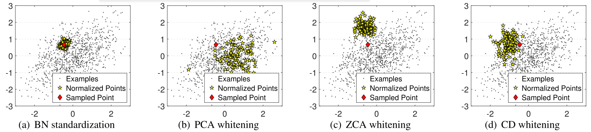

# StochasticityBW

Code for reproducing the results of our accpeted CVPR 2020 paper (Oral):
**An Investigation of Stochasticity of Batch Whitening** ([arXiv:2003.12327](https://arxiv.org/abs/2003.12327)), where we qualitatively and quantitively investigate the stochasticity caused by Batch Whitening (BW), during training and inference. 




This repo provides the Pytorch and Tensorflow implementations of different whitening methods. 
* `SBW_Classification_PyTorch`: Pytorch project for reproducing the discriminative classification experiments
* `SBW_GAN_TF`: Tensorflow project for reproducing the GAN experiments.


## Citations
If you find this repo benefits your research, please consider citing:
```
@inproceedings{2020_CVPR_Huang,
  author    = {Lei Huang and Lei Zhao and Yi Zhou and Fan Zhu and Li Liu and Ling Shao},
  title     = {Iterative Normalization: Beyond Standardization towards Efficient Whitening},
  booktitle = {IEEE Conference on Computer Vision and Pattern Recognition (CVPR)},
  year      = {2020},
  }
```

 ## Contact
Email: lei.huang@inceptioniai.org.

